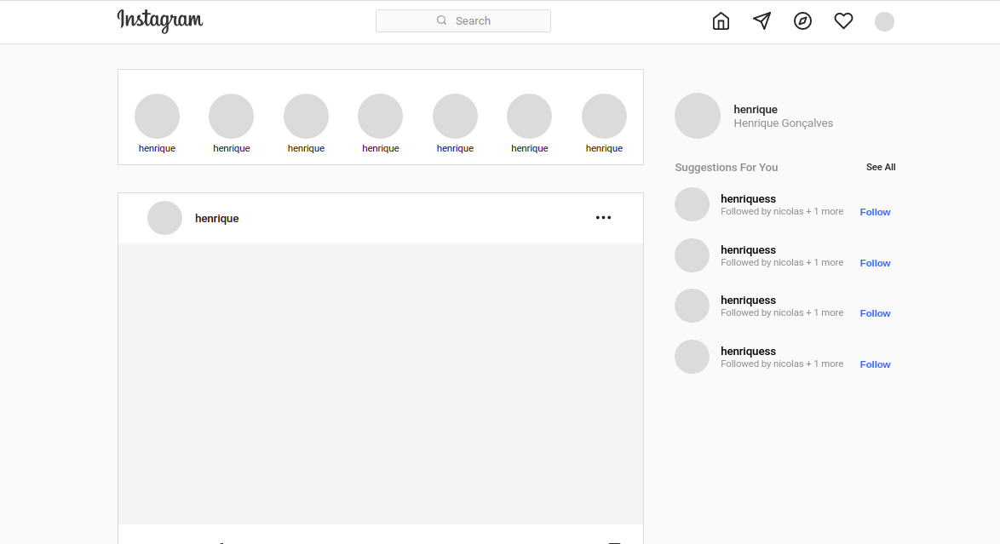

<h2 align="center">Clone UI Instagram</h2>
<h4 align="center">
  Clone of the Instagram web interface
</h4>

  

  

  
  

  <a href="#rocket-technologies">Technologies</a>&nbsp;&nbsp;&nbsp;|&nbsp;&nbsp;&nbsp;
  <a href="#memo-license">License</a>

   

## :rocket: Technologies

This project was developed with the following technologies:

- [Next.js](https://nextjs.org/)
- [Typescript][ts]
- [styled-components](https://www.styled-components.com/)
- [react-icons](https://react-icons.github.io/react-icons/)
- [VS Code][vscode] with [EditorConfig][vceditconfig] and [ESLint][vceslint]

## :memo: License

This project is under the MIT license. See the [LICENSE](https://github.com/Henrique82g/clone-instagram/blob/master/LICENSE) for more information.

---

Made with ♥ by Henrique Gonçalves :wave: [Get in touch!](https://www.linkedin.com/in/henriquegoncalvesg/)

[ts]: https://www.typescriptlang.org
[vscode]: https://code.visualstudio.com/
[yarn]: https://yarnpkg.com/
[vceditconfig]: https://marketplace.visualstudio.com/items?itemName=EditorConfig.EditorConfig
[vceslint]: https://marketplace.visualstudio.com/items?itemName=dbaeumer.vscode-eslint
